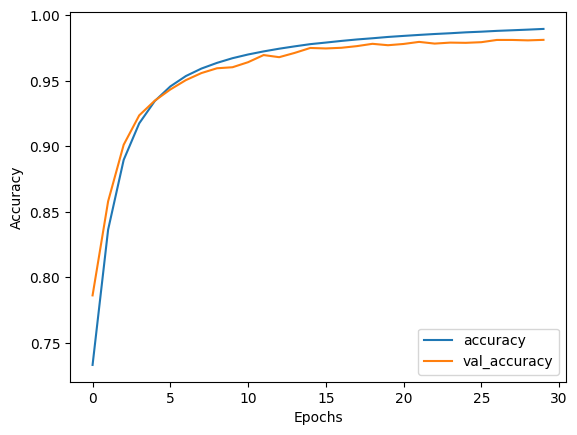

## Devnagari Nepali to Roman Nepali Transliteration

This repo contains training code for converting devnagari nepali word to roman nepali word using character level sequence to sequence model.

Also model is deployed for inference.

## Model can be accessed via API

Model deployed with `FastAPI Server` and can be accessed via api.
[MODEL API SERVER](./api/)

## Experiment:

Training different model with different architecture, parameters and data.

> Dataset used to train is from HuggingFace and can be found with Roman Nepali Transliteration name.

## Model 0: Simple Encoder Decoder Character Level

Trained on `10k` translation with simple `Encoder Decoder` Architecture and was trained for `100 Epochs` with batch size of `32 batch size`.

**[Model 0 Training Note](./training/02_mini_train.ipynb)**

The model is trained as character level prediction.

#### MODEL 0 `Training and Validation` `loss and accuracy.`

- The model training well steadily over epoch and is fitting the training data well
- The validation accuracy pleateaus around epoch 30 and after it fluctuates slightly, indicating the model is `overfitting` the training data.
- Here simply I got `overfitting` result but the model is learning properly on the training data.

    
    

## Model 1: Train data size 100k sample

Trained on `100k` dataset with simple `Encoder Decoder` Architecture and was trained for `35 Epochs` because model was overfitting and also batch size was increase to `64`.

**[Model 1 Training Note](./training/02_mini_train.ipynb)**

The model is trained as character level prediction.

#### MODEL 1 `Training and Validation` `loss and accuracy.`

- Model improve than the previous as the training and validation generalization error are same.

    
    

##### Inference Example on Model 1 : Model making some minor error

> text = "सहकारी ठगी संगठित अपराध र सम्पत्ति शुद्धीकरणसम्बन्धी कसूरमा अनुसन्धानका लागि वीरगन्ज ल्याइएका राष्ट्रिय स्वतन्त्र पार्टी रास्वपा का सभापति रवि लामिछानेसँग मंगलबार पर्सा सरकारी वकिलको कार्यालयमा करिब घन्टा बयान लिइएको छ"

> Translated = "sahakari thagi sangathit aparadh rupma sampatti shuddhikaransambandhi kasurma anusandhanka lagi virganj lyaieka rashtriya swatantra parti raswapa kat sabhapati ravi lamichhanesanga mangalbar parsa sarkari wakilko karyalayama karib ghanta bayan liieko chha"
